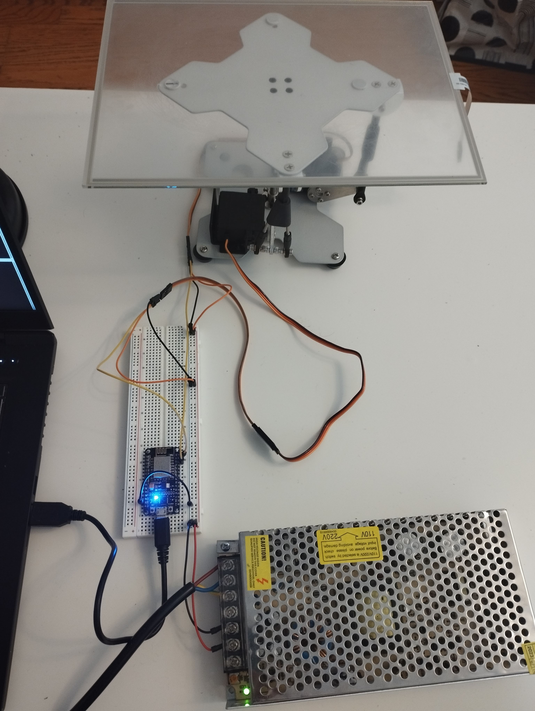
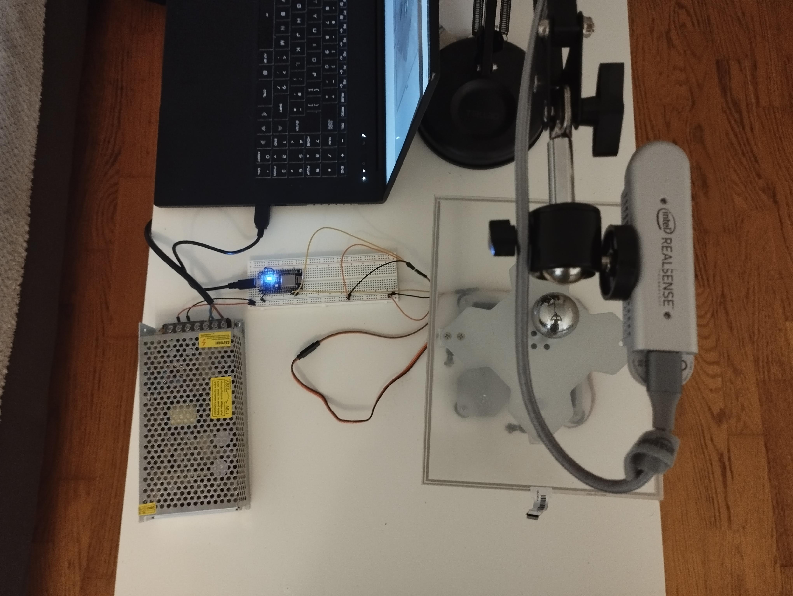
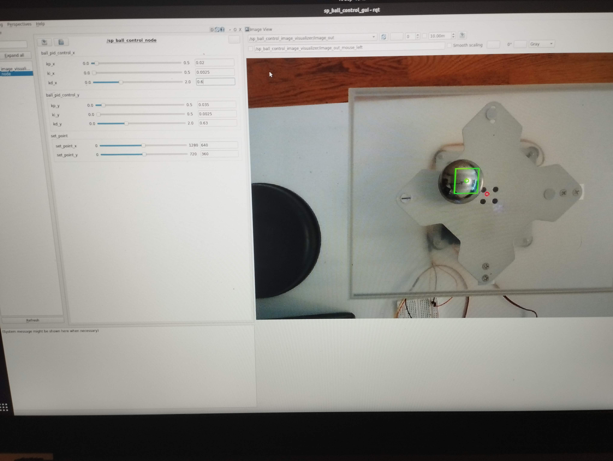

# servo_platform

This repository contains packages to interface with a 2 Degrees of Freedom parallel platform.
The platform contains 2 Servos and is used to as a test bench to implement different control strategies to
accomplish tasks such as controlling the position of a ball on the platform.

## The hardware

* The parallel platform:
It contains 2 high performance Servos and a resistive screen.

* Microcontroller NodeMcu ESP8266: The microcontroller is used to command the servos through PWM signals.
The device also reads the current position of the servos and sends the information to the host.
The communication between the host and the microcontroller is done through a serial port every 20ms.
The microcontroller and the servos are powered by a 5V power supply.

* The host: The host is a computer running Ubuntu 20.04 with docker.
* Realsense D415 Camera: The camera is used to detect the position of a ball on the plaform.
It provides a depth image and a color image.

## The software
* `sp_driver`: This package implements a C++ library to communicate with the microcontroller and send commands to the
servos from the host.
* `sp_ros_driver`: This package uses the previous driver and implements a `ROS` node to communicate with the microcontroller. There are scripts to interact with the platform and also to use a xbox controller to command it.
* `sp_control`: Implementation of control algorithms to perform tasks with the platform. Currently there is only one
controller implemented which is a PID algorithm to control the position of a ball on the platform.
* `sp_perception`: This package implements different perception algorithms that the controllers can use as a feedback.
Currently there is a node to track the position of a ball on the platform. The default tracker is `CSRT` from `OpenCV`.
* `sp_visualization`: This package implements nodes to visualize the state of the platform and the variable to control.
Currently there is a node that reads the state of the PID controller (set point), the position and the bounding box of
the ball and creates an image with this information and publishes it. This image can be visualized with `rqt_image_view`.

## Ball on plate
The first controller implemented is a PID controller to control the position of a ball on the platform.
Its parameters have been exposed through the `dynamic_reconfigure` package so they can be tuned in real time.
The controller uses the position of the ball on the platform as a feedback. This position is the output of the
tracking algorithm. The controller computes the control action and sends it to the ROS driver node. The image is
captured from a Realsense located on the top of the platform.

## Next steps
This project has just started and there are many things to do. First of all, the purpose of this project is to have
a test bench to implement different control and perception algorithms, which could be based on classical
control theory/computer vision or machine learning. Another objective is to find a way to
deploy the software as in production. Bearing this in mind, we can classify tasks in short term and
long term.

### Short term
* Implement a node to generate step trajectories to fine tune the PID controller.
* Fill in doxygen documentation.
* Refactor the PID controller code. Create a PID controller class and the SpBallController will use this class
through composition (one instance for x and another for y).
* Fine tune the parameters. The current response has oscilations and big position error. This could be solved by
a better tuning, improving the mechanical clearance or linearizing the system.
* Create launch file to start the controller easily.
* Create a configuration for rqt to launch it as a GUI (dynamic reconfigure server, image_view, real time plots).
* The platform suffers from huge mechanical clearance, which adds more non linearity to the system. Find a way to
reduce them.
* Integration with mediapipe.

### Long term
* Find a tracking algorithm that can run on a GPU, the implementation of the current one uses CPU.
* Perhaps use the Jetson Nano to deploy the tracking algorithm and release the host laptop from this task.
* Containerize the application.
* Implement a simulation of the ball control task so that Agents can learn.
* Train a RL algorithm to control the ball position and transfer it to the real platform. Perhaps it could use
Imitation learning from the current PID controller to learn faster.
